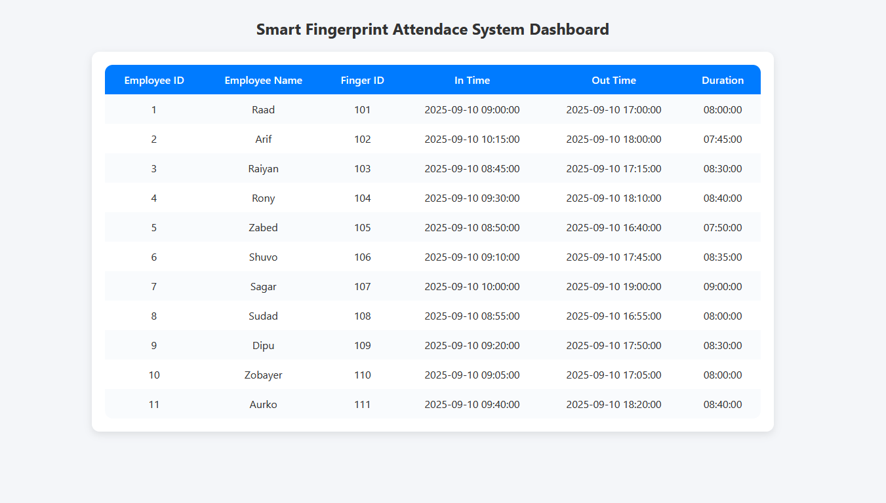
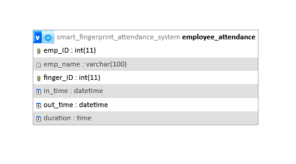

# Smart Fingerprint Attendance System

**Author:** Shah Ahmed Raad  
**GitHub:** [Thunder10046](https://github.com/Thunder10046?tab=repositories)  
Industrial Attachment Project - GizanTech 
---

## Overview
This project implements a Smart Fingerprint Attendance System using the ESP32 microcontroller and a fingerprint sensor.  

It provides:

- Fingerprint-based enrollment  
- Real-time attendance logging to a remote MySQL server  
- Offline storage in SPIFFS when Wi-Fi is unavailable  
- Auto-sync of offline data once Wi-Fi reconnects  
- OTA updates for easy firmware maintenance  
- Accurate timestamps using NTP server  

---


## Screenshots 

### Web Frontend (PHP `index.php`)



---

## Database Design

### ER Diagram



---

## Setup & Installation

### Hardware Connections
| Fingerprint Sensor | ESP32 Pin |
|--------------------|-----------|
| VCC                | 3.3V      |
| GND                | GND       |
| TX                 | GPIO16    |
| RX                 | GPIO17    |

### Configure Wi-Fi
```cpp
const char* ssid = "YourWiFiSSID";
const char* password = "YourWiFiPassword";
```cpp

### Configure Server URL
```cpp
const char* serverName = "http://<your-server-ip>/attendance_app/index.php";

